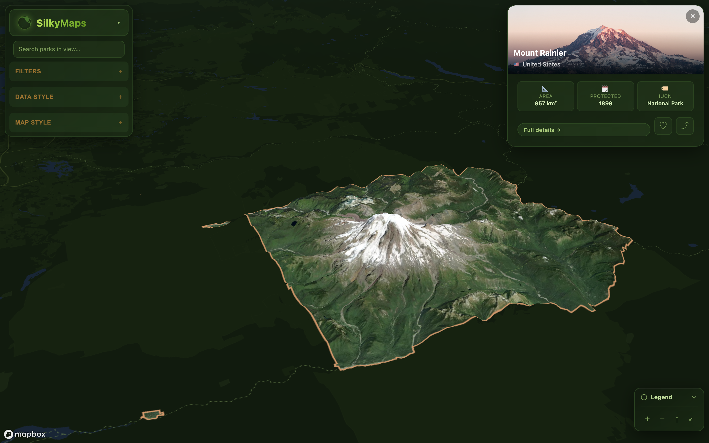
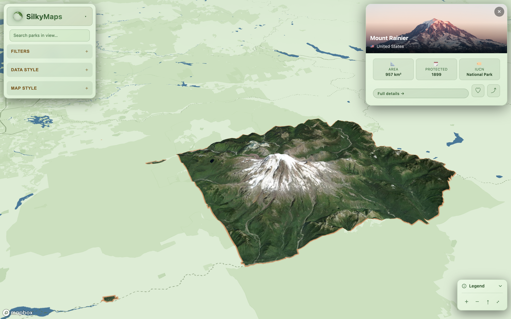
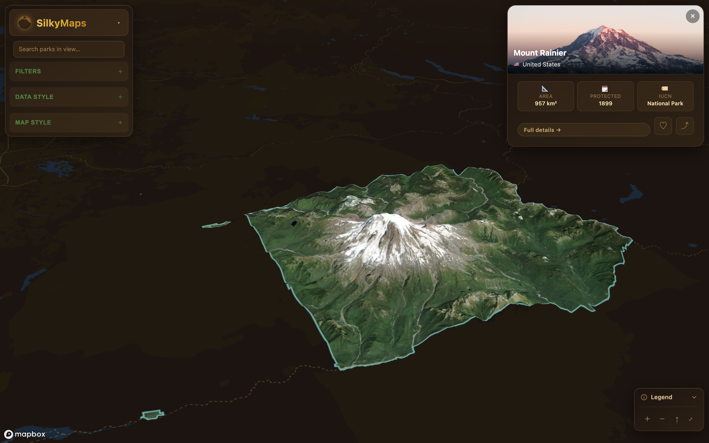
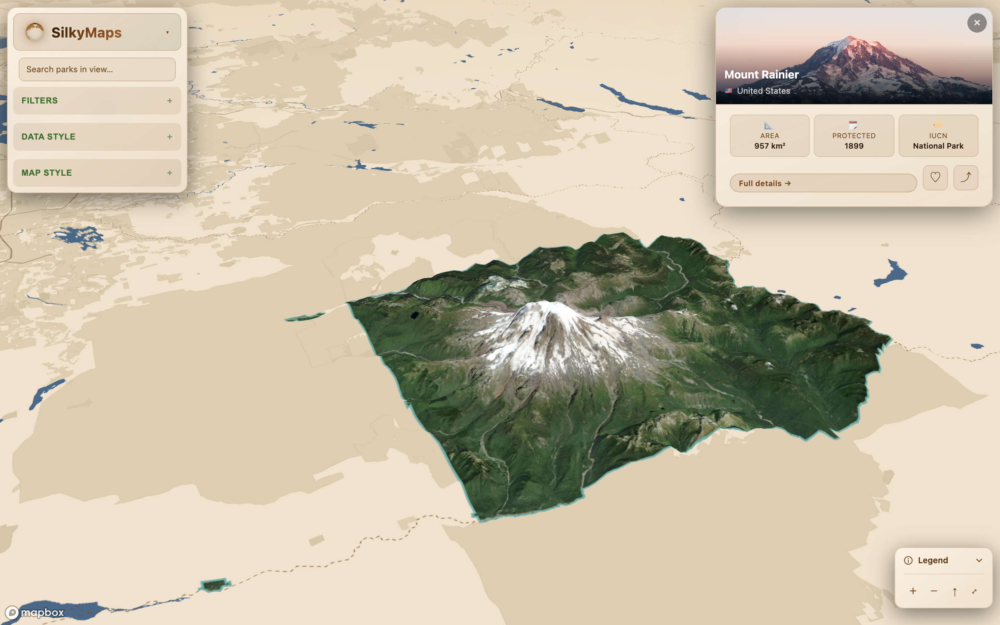
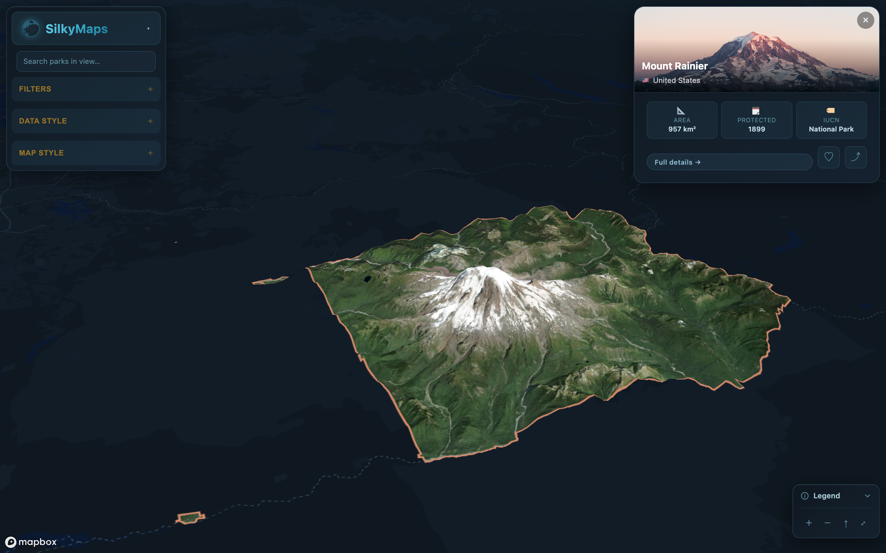
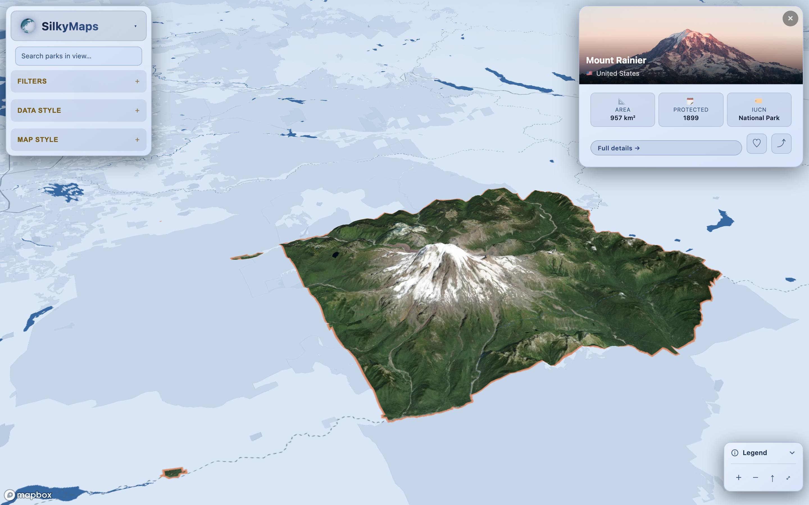
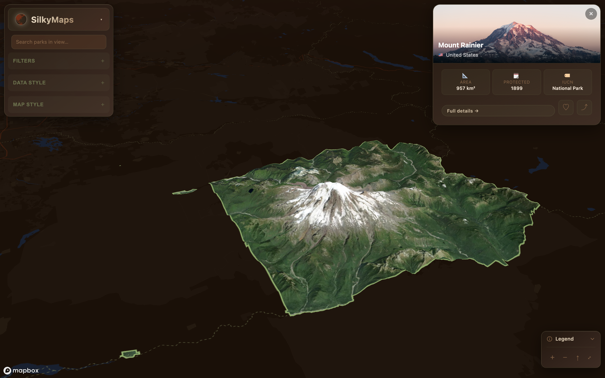
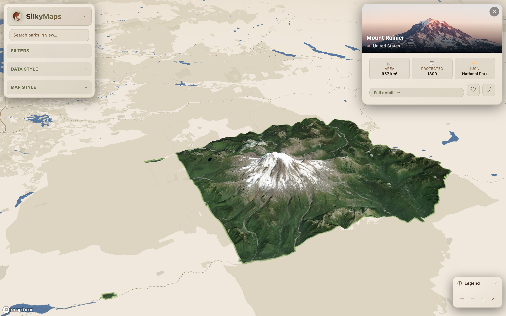

# Silky Maps

A personal sandbox for **exploring aesthetic digital cartographic experiences** through the World Database on Protected Areas (WDPA) as the underlying dataset. Every park on Earth — ~270k polygons — becomes a canvas for trying out themed basemaps, custom shading palettes, terrain exaggeration, and selection treatments. The same Mt Rainier silhouette below renders eight different ways without changing a single line of style code at runtime; the goal is to make the map *feel* different rather than just *look* different.

| | Dark | Light |
|---|---|---|
| **Sage Forest** |  |  |
| **Dark Earth** |  |  |
| **Slate Mist** |  |  |
| **Botanica** |  |  |

*Mount Rainier National Park, captured at the same camera (pitch 60°, bearing 25°) across the four themes in both modes. The satellite imagery inside the silhouette is pre-stitched and clipped to the polygon at fetch time, so the surrounding basemap repaints with each theme without disturbing the overlay. Re-generate with `node scripts/capture-rainier.mjs` (requires `npm run dev` and Playwright's chromium).*

### Hiking-route overlay

The Wonderland Trail circling Mt Rainier, captured the same way as the parks above but with a trail selected instead of a park. Trails are an optional OSM-derived overlay (separate `.pmtiles`) themed from the same palette, so the casing/halo treatment stays legible across every basemap.

| | Dark | Light |
|---|---|---|
| **Sage Forest** |  |  |
| **Dark Earth** |  |  |
| **Slate Mist** |  |  |
| **Botanica** |  |  |

*Generate with `node scripts/capture-trails.mjs` after running `scripts/build-trails-pmtiles.sh` and hosting the resulting `trails.pmtiles` / `thruhikes.pmtiles` (the trails overlay is optional — when `VITE_TRAILS_PMTILES_URL` is unset, the layers and the Trails control-panel section are omitted entirely).*

## What's interesting in here

- **A hand-built themable basemap.** Four palettes (Sage Forest, Dark Earth, Slate Mist, Botanica), each with paired dark and light modes, generated from a single `UiPalette` token set. Every UI surface and every map layer (water, landcover, hillshade, contours, roads, labels, fog) reads from the same palette, so swapping themes repaints the entire screen — chrome and cartography — in step.
- **Polygon-clipped satellite selection overlay.** Clicking a park pre-fetches Mapbox satellite tiles at the highest zoom whose covering grid fits in 4096px, stitches them into a single canvas, and clips the canvas to the park polygon during stitching. The result is a PNG with transparent edges shaped exactly like the silhouette — basemap shows through naturally outside the park, no separate mask layer, no LOD-swap flicker. "Full details" layers a slow orbit tour (90s/revolution) on top.
- **Whole WDPA in one file.** ~270k polygons served as a single `.pmtiles` archive over HTTP range requests via Mapbox GL v3.21+'s native PMTiles support — no tile server, no `addProtocol` shim. Theming + filtering happen entirely client-side.
- **OSM hiking-route overlay with elevation-aware tour.** A second `.pmtiles` (built by `scripts/build-trails-pmtiles.sh`: osmium → spatial-join with WDPA → tippecanoe) layers global hiking routes on top of the parks, themed from the same palette so they read as part of the cartography rather than a bolted-on data layer. Selecting a trail opens a panel with a procedurally drawn elevation profile sampled from Mapbox's terrain DEM, then a "Fly along" tour walks the camera tangent to the line via `@turf/along` + `requestAnimationFrame`.
- **Strict command-pattern for the map.** React components never call Mapbox GL directly; everything routes through `MapEngine.execute(MapCommand)`. Makes it easy to tear apart and re-skin the map without the visual layer leaking everywhere.

## Quick Start

### 1. Install dependencies
```bash
npm install
```

### 2. Set environment variables

Create a `.env` file in the root directory:
```bash
VITE_MAPBOX_ACCESS_TOKEN=your_mapbox_token_here
VITE_PMTILES_URL=https://pub-<hash>.r2.dev/wdpa.pmtiles
```

### 3. Host the PMTiles file

The app loads protected-areas data directly from a single `.pmtiles` file
via the PMTiles support built into Mapbox GL JS v3.21+. Any host that
supports HTTP range requests and CORS works (Cloudflare R2, S3, etc.).

Required CORS rules on the bucket:

```json
[
  {
    "AllowedOrigins": ["http://localhost:5173", "https://your-prod-domain"],
    "AllowedMethods": ["GET", "HEAD"],
    "AllowedHeaders": ["Range", "If-Match", "If-None-Match"],
    "ExposeHeaders": ["Content-Length", "Content-Range", "Accept-Ranges", "ETag"]
  }
]
```

For local development without a remote bucket, serve the file with a
range-capable static server:

```bash
npx serve /path/to/spatialData -l 8080 --cors
# then set VITE_PMTILES_URL=http://localhost:8080/wdpa.pmtiles
```

### 4. (Re)building the PMTiles file from raw WDPA

```bash
tippecanoe -o wdpa.pmtiles -l geo -zg \
  --drop-densest-as-needed --force wdpa_poly.geojson
```

The layer name **must** be `geo` (matches `SOURCE_LAYER` in
`src/features/map/engine/styleAugmentation.ts` and `MapEngine.ts`).

### 5. Run the development server
```bash
npm run dev
```

### 6. Build for production
```bash
npm run build
```

## Environment Variables

| Variable | Description | Default |
|----------|-------------|---------|
| `VITE_MAPBOX_ACCESS_TOKEN` | Mapbox GL access token | Required |
| `VITE_PMTILES_URL` | Public URL to the WDPA `.pmtiles` file | `http://localhost:8080/wdpa.pmtiles` |
| `VITE_TRAILS_PMTILES_URL` | Public URL to the trails `.pmtiles` (optional — trail layers don't render if unset) | unset |
| `VITE_THRUHIKES_PMTILES_URL` | Public URL to the long-distance routes `.pmtiles` (optional) | unset |

## How the PMTiles ↔ Mapbox integration works

Mapbox GL JS v3.21+ ships with **native PMTiles support** in its vector
source. There is no `addProtocol`, no `mapbox-gl-pmtiles-provider` shim,
and no `/{z}/{x}/{y}.pbf` tile server — Mapbox detects the `.pmtiles`
extension and switches to PMTiles mode automatically. Three pieces make it
work end-to-end in this app:

### 1. The vector source declaration

In [`src/features/map/engine/styleAugmentation.ts`](src/features/map/engine/styleAugmentation.ts):

```ts
'national-parks': {
  type: 'vector',
  url: PMTILES_URL,           // single .pmtiles file on R2/S3/etc.
  promoteId: 'SITE_PID',      // use SITE_PID as feature.id (see below)
}
```

Note `url:` (not `tiles: [...]`) — this is what tells Mapbox to read the
URL as a single archive instead of a tile template. Layers in the same
spec reference `'source-layer': 'geo'`, which is the layer name baked
into the PMTiles by tippecanoe (`-l geo` in step 4 above).

### 2. HTTP Range requests + CORS

Mapbox doesn't download the whole `.pmtiles` file. It issues a series of
HTTP `Range` requests:

1. First range: bytes `0-127` to read the PMTiles header (magic + root
   directory offset + root-tile offset, etc.).
2. Then byte ranges for the directory entries it needs.
3. Then byte ranges for the individual tiles the current viewport needs,
   on demand, as you pan/zoom.

This is why the bucket CORS config has to allow the `Range` request
header *and* expose `Content-Range`, `Accept-Ranges`, and `ETag` in the
response — Mapbox uses those response headers to validate that the host
actually supports range requests, and to cache directory pages between
requests. Strip any of those headers and PMTiles silently falls back to a
broken state (the request "succeeds" but Mapbox can't parse offsets).

### 3. The Mapbox worker fix (Vite-specific)

PMTiles tile fetches happen inside Mapbox's Web Worker. By default Mapbox
ships its worker as an inlined string and instantiates it via `Blob` URL.
Under Vite, the blob URL inherits Vite's HMR helper injections (e.g.
`__vite__injectQuery`), which then crash inside the worker context where
those helpers don't exist — the worker dies, and PMTiles fetches silently
stop. See [mapbox-gl-js#12656](https://github.com/mapbox/mapbox-gl-js/issues/12656).

The fix in [`MapEngine.ts`](src/features/map/engine/MapEngine.ts) is to
let Vite bundle Mapbox's worker as a real module with a stable URL:

```ts
import MapboxWorker from 'mapbox-gl/dist/mapbox-gl-csp-worker?worker'
;(mapboxgl as any).workerClass = MapboxWorker
```

This *must* run before the first `new mapboxgl.Map(...)` call (it does —
the import sits at the top of `MapEngine.ts`). Without this, you'll see
the basemap render fine but the parks layer never appears, often with no
console error.

### Why `promoteId: 'SITE_PID'` matters

Mapbox's `setFeatureState({ source, sourceLayer, id }, ...)` keys on the
*feature id*, not on arbitrary properties. Tippecanoe doesn't assign
feature ids by default — every park comes through as `feature.id =
undefined`. `promoteId` tells Mapbox "use the `SITE_PID` property as the
feature id," which is how hover highlights, the `selected` outline-only
state during the orbit tour, and the feature-state persistence across
tile refetches all stay tied to the right park.

### Putting it all together

```
WDPA GeoJSON
   │  tippecanoe -o wdpa.pmtiles -l geo …
   ▼
wdpa.pmtiles  (single ~hundreds-of-MB file)
   │  HTTP PUT to Cloudflare R2 / S3 / any range-capable static host
   ▼
R2 bucket (with CORS exposing Range + Content-Range + Accept-Ranges)
   │  HTTP Range requests, on demand, per viewport tile
   ▼
Mapbox GL JS vector source (PMTiles mode, decoded inside the Vite-bundled
worker, promoted to feature.id = SITE_PID, rendered by parks-fill /
parks-outline layers)
```

## Tech Stack

- React 18
- TypeScript
- Vite
- Mapbox GL JS

## Data Source

Protected areas data from the [World Database on Protected Areas (WDPA)](https://www.protectedplanet.net/).

## License

MIT
